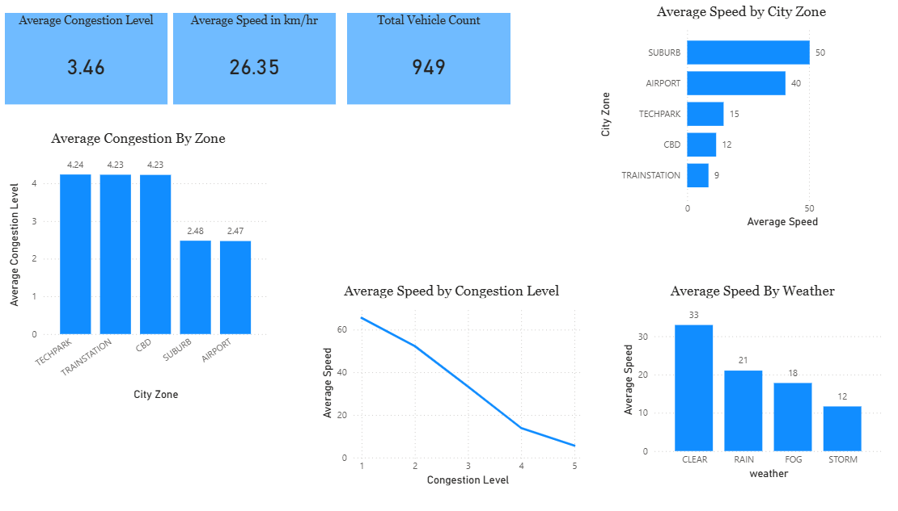

# Real-Time Traffic Data Engineering Pipeline

## Overview

This project is an end-to-end real-time traffic data engineering pipeline built to learn and demonstrate Kafka, Spark Structured Streaming, Delta Lake, and medallion architecture in a practical way.

The system simulates realistic traffic events, ingests them through Kafka, lands them in a Bronze layer, cleans and validates them in Silver, and models them into analytics-ready Gold datasets for dashboarding and future ML use cases.

Pipeline flow:

`Traffic Producer -> Kafka -> Bronze -> Silver -> Gold -> Power BI`

## Tech Stack

- Python
- Apache Kafka
- Apache Spark Structured Streaming
- Delta Lake
- Docker
- Hive Metastore 

## Data Description

The project uses synthetic traffic events, but the data is not purely random.

Each event includes fields such as:

- `vehicle_id`
- `road_id`
- `city_zone`
- `speed`
- `congestion_level`
- `traffic_volume`
- `incident_flag`
- `weather`
- `event_time`

The generator models realistic relationships between variables:

- higher congestion usually leads to lower speed
- bad weather increases congestion pressure and reduces speed
- rush hour affects congestion and traffic volume
- different zones behave differently, such as CBD, airport, suburb, and train station

The producer also injects dirty records intentionally:

- null values
- wrong data types
- extreme speeds
- duplicates
- late and future timestamps
- schema drift
- malformed payloads

This makes the pipeline more realistic and gives the Silver layer meaningful cleaning and validation work.

## Architecture

### Bronze

Purpose: preserve raw truth

- reads traffic events from Kafka
- stores raw JSON for traceability
- applies only minimal parsing
- writes raw-ish data to Delta Lake

Bronze is the source-of-truth landing layer, not the place for aggressive cleaning.

### Silver

Purpose: produce clean and trustworthy data

- safely casts data types
- validates records with explicit quality flags
- preserves rejected rows separately instead of silently dropping them
- applies watermarking and deduplication
- adds simple feature engineering such as `hour`, `peak_flag`, `speed_band`, and `traffic_band`

Silver outputs:

- `traffic_silver`
- `traffic_silver_rejected`

Key design decision:

> Instead of silently dropping invalid rows, I preserved them in a separate rejected Delta stream with validation reasons, so the pipeline remains auditable and upstream data issues stay visible without polluting downstream analytics.

### Gold

Purpose: produce analytics-ready datasets

Gold reshapes Silver data into business-friendly outputs for BI and downstream analysis.

Gold outputs include:

- `fact_traffic`
- `dim_zone`
- `dim_road`
- `dim_weather`
- `gold_zone_hourly_metrics`
- `gold_road_hourly_metrics`

The current Gold layer is best described as star-schema-inspired:

- a fact-like event table
- lookup-style dimension tables
- hourly aggregate tables for dashboards

## Why Delta Lake

Delta Lake is used to make streaming storage more reliable and table-like.

Benefits:

- ACID transactions
- reliable streaming writes
- schema management
- transaction logs via `_delta_log`
- a cleaner path toward managed/queryable tables later

## Hive Metastore Concept

The data is physically stored as files in the warehouse paths, but the metastore concept is what turns file paths into queryable tables by tracking metadata such as schema and table location.

In simple terms:

- files hold the data
- the metastore holds the metadata that makes those files behave like tables

Note: Gold data is physically stored as Delta Lake tables under the `warehouse/` directory. These tables consist of Parquet data files plus a `_delta_log` transaction log. Spark understands this layout natively, but BI tools such as Power BI usually work better with registered tables exposed through a SQL/catalog layer rather than raw storage paths alone. A Hive Metastore provides that catalog layer by registering file-backed datasets as queryable tables.

## Current Outputs

The pipeline outputs are written to the local warehouse/ directory. That folder is gitignored, so generated data files are not committed to the repository, but the code creates and writes the expected output paths during execution.

### Silver Tables

- `traffic_silver`
- `traffic_silver_rejected`

### Gold Tables

- `fact_traffic`
- `dim_zone`
- `dim_road`
- `dim_weather`
- `gold_zone_hourly_metrics`
- `gold_road_hourly_metrics`

## Dashboard

The Gold layer is consumed in Power BI to highlight traffic efficiency, congestion hotspots, weather impact, and zone-level operational risk. A sample dashboard is created to demonstrate business insights.



The dashboard focuses on a few high-value business questions:

- which zones are most congested
- how speed drops as congestion increases
- how weather conditions affect traffic flow
- which areas consistently experience slower traffic

## Running the Pipeline

### 1. Start the producer

```powershell
python -m producer.traffic_producer
```

### 2. Run Bronze

```powershell
docker exec -it spark-worker /opt/spark/bin/spark-submit --conf spark.jars.ivy=/tmp/.ivy --packages io.delta:delta-spark_2.12:3.2.0,org.apache.spark:spark-sql-kafka-0-10_2.12:3.5.1 /opt/project/src/pipelines/bronze/kafka_to_bronze.py
```

### 3. Run Silver

```powershell
docker exec -it spark-worker /opt/spark/bin/spark-submit --conf spark.jars.ivy=/tmp/.ivy --packages io.delta:delta-spark_2.12:3.2.0 /opt/project/src/pipelines/silver/traffic_to_silver.py
```

### 4. Run Gold

```powershell
docker exec -it spark-worker /opt/spark/bin/spark-submit --conf spark.jars.ivy=/tmp/.ivy --packages io.delta:delta-spark_2.12:3.2.0 /opt/project/src/pipelines/gold/traffic_to_gold.py
```

## Inspection Helpers

Inspect Silver:

```powershell
docker exec -it spark-worker /opt/spark/bin/spark-submit --conf spark.jars.ivy=/tmp/.ivy --packages io.delta:delta-spark_2.12:3.2.0 /opt/project/src/pipelines/silver/inspect_silver.py
```

Inspect Gold:

```powershell
docker exec -it spark-worker /opt/spark/bin/spark-submit --conf spark.jars.ivy=/tmp/.ivy --packages io.delta:delta-spark_2.12:3.2.0 /opt/project/src/pipelines/gold/inspect_gold.py
```

## Limitations

Current limitations include:

- the producer emits one event at a time rather than simulating many concurrent vehicles
- local Spark resources are limited, so layers are often run sequentially during development
- Gold uses a star-schema-inspired model rather than a strict warehouse star schema with surrogate keys

## Future Work

- machine learning with MLflow
- drift detection
- monitoring and alerting
- table registration in metastore
- performance tuning and production hardening
